## ✔ IMAGE ENCRYPTION DECRYPTION
- An Image Encryption Decryption is an image processing application created in python with tkinter gui and OpenCv library.
- In this application user can select an image and can encrypt that image to gray scale image and can even decrpyt also.
- Also after encrypting and decrypting user can also save the edited image anywhere in the local system.
- Also there is option to reset to the original image.

	
	
	
	

	
	
	
	

	
	
	
	

	
	
	
	
	
	

	

****

### 📌REQUIREMENTS :
- python 3
- os module
- cv2 module
- tkinter module
- filedialog from tkinter
- messagebox
- from PIL import Image, ImageTk
- numpy
- random

****

### 📌HOW TO Use it :
- User just need to download the file, and run the image_encryption_decryption.py, on local system.
- After running a GUI window appears, where user needs to choose an image file using CHOOSE button on the top right corner.
- After selecting the image, two images will appear on screen one on left side, which is original and one on write in which Encrypted Decrypted format will be shown.
- Now user can start encryption and decryption using Encrypt and Decrypt button.
- After editing user can also save the edited image to any location in local system using SAVE button.
- Also there is a RESET button, clicking on which resets the edited image to original format.
- Also there is exit button, clicking on which we get a exit dialog box asking the permission to exit.

### 📌Purpose :
- This scripts helps us to easily encrypt any image for security purpose and can even decrypt also.

### 📌Compilation Steps :
- Install tkinter, PIL, numpy, cv2, os, random
- After that download the code file, and run image_encryption_decryption.py on local system.
- Then the script will start running and user can explore it by encrypting and decrypting any image and saving it.

****

### 📌SCREENSHOTS :

  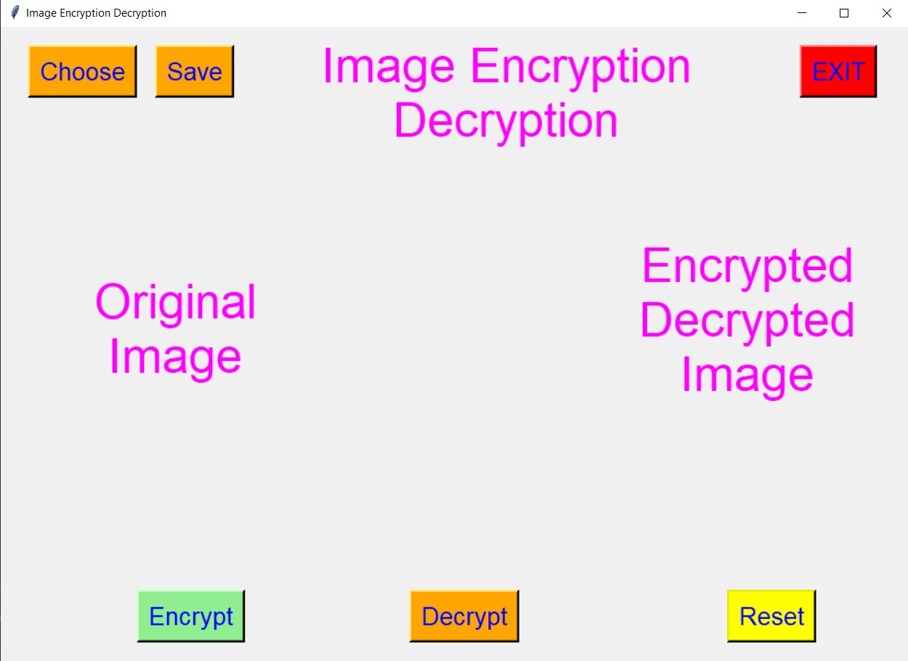 
  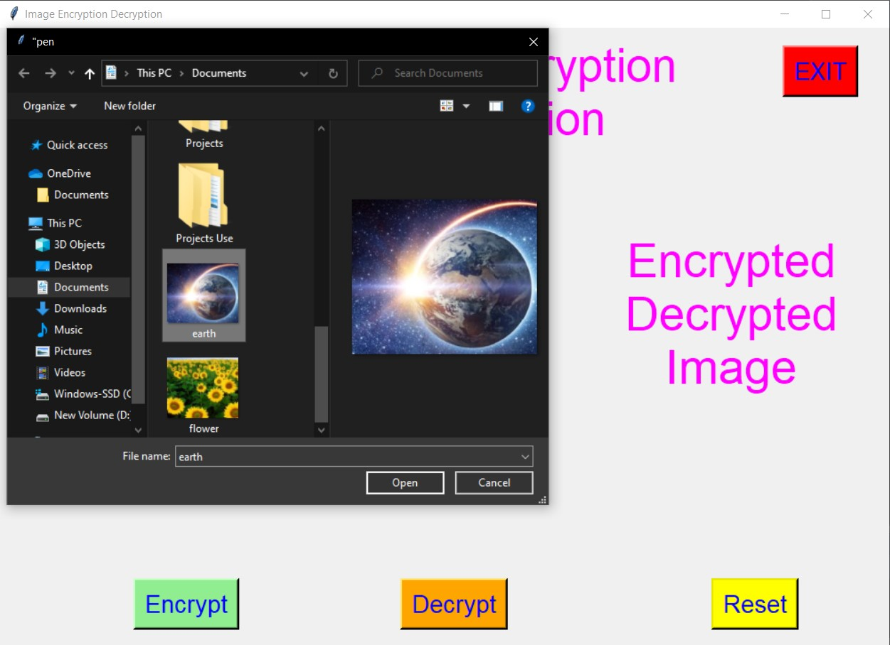 
  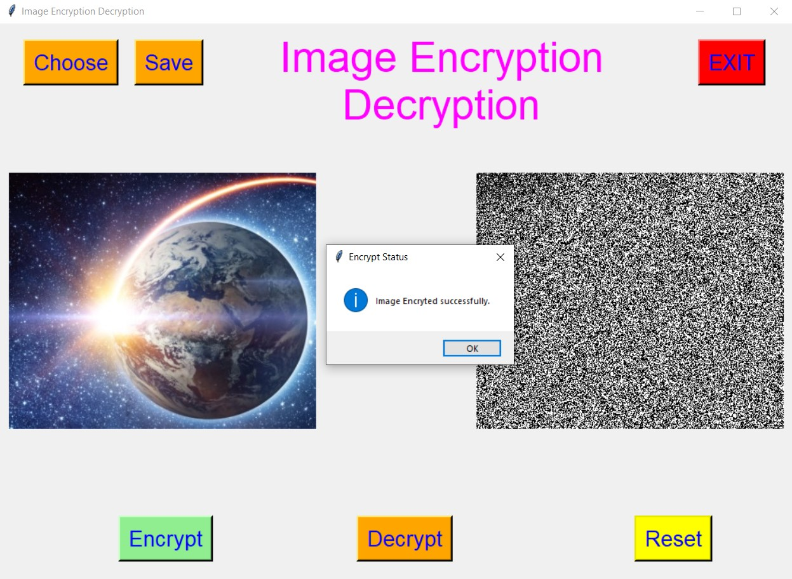 
  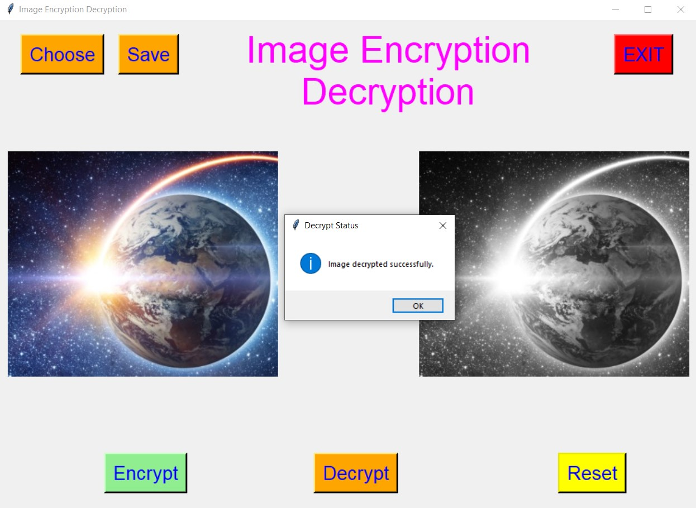 
  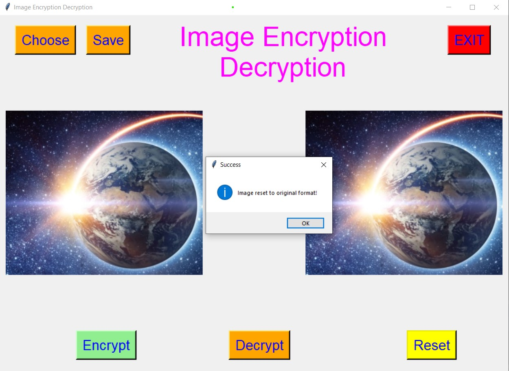 
  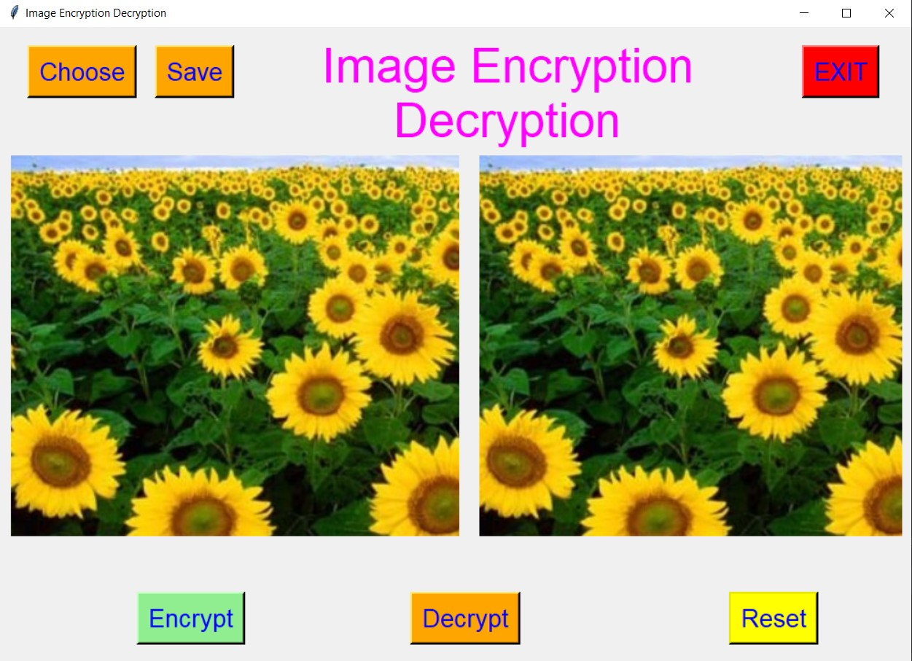 
  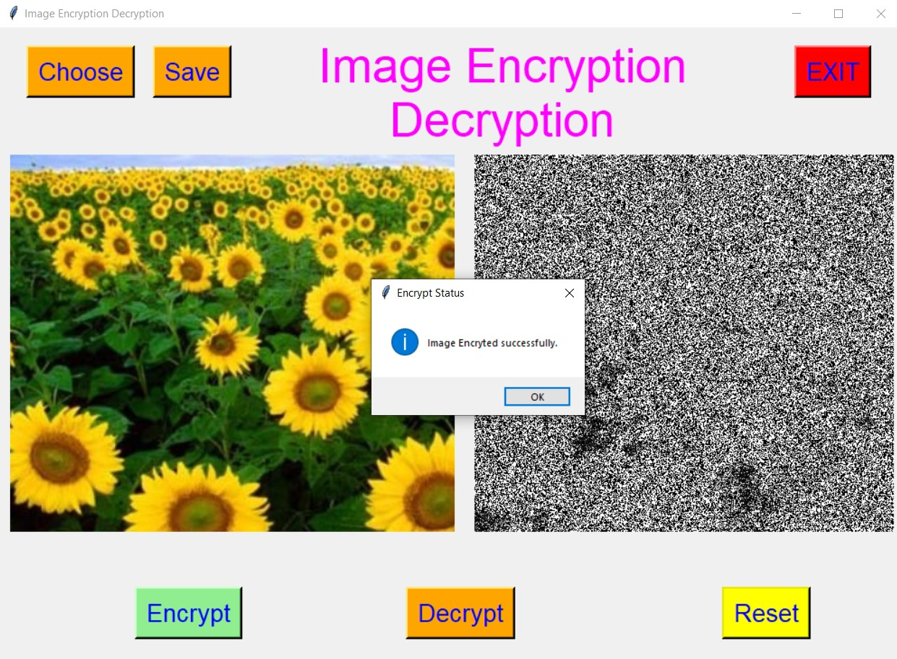 
  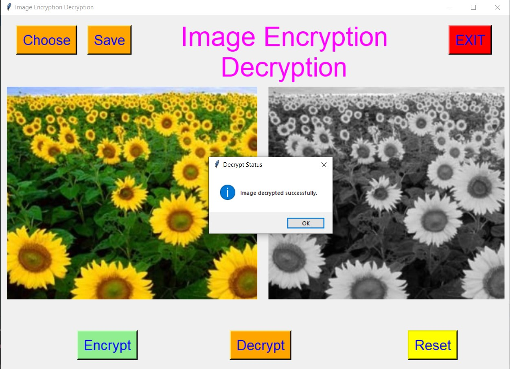 
  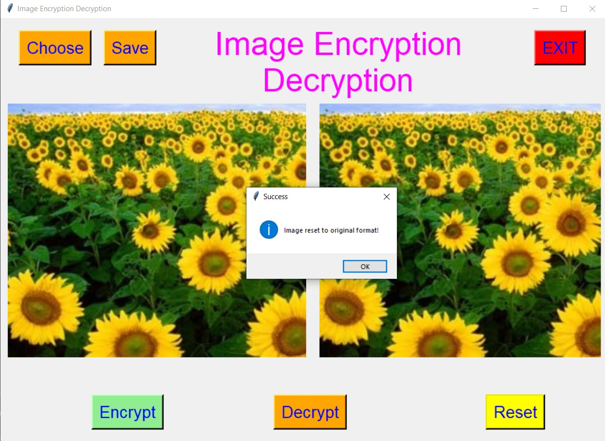 
  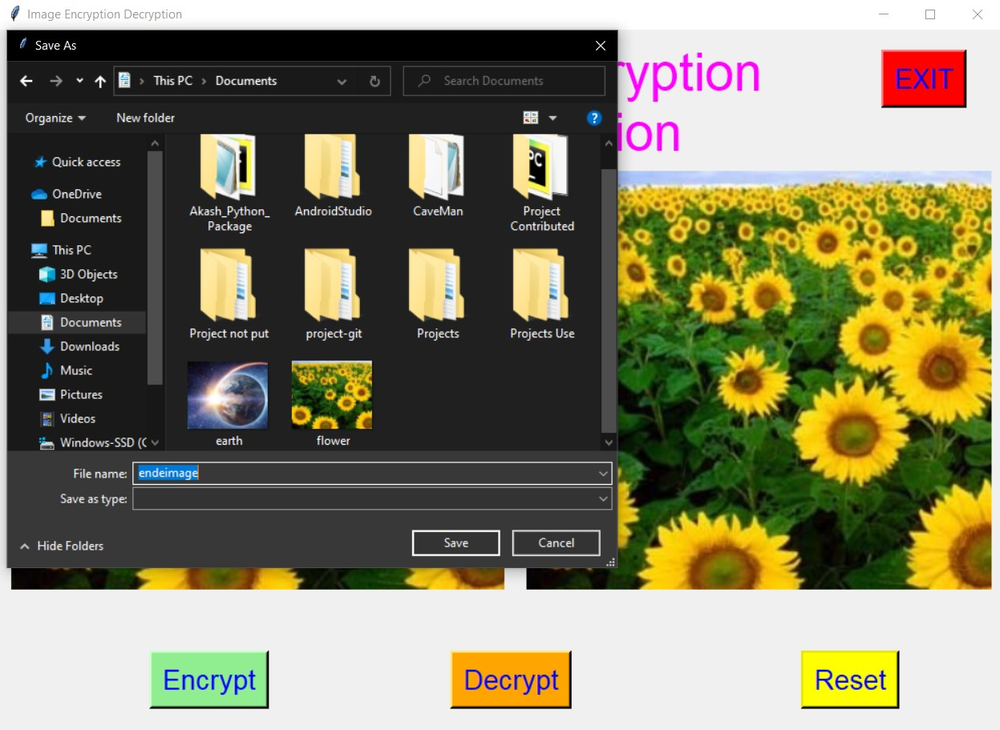 
  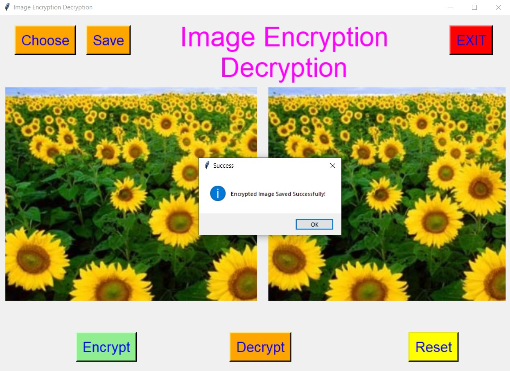 

****

### 🌟Stargazers Over Time:

****

### 🌟Forkers Over Time:

****

### 📌Contributors:

